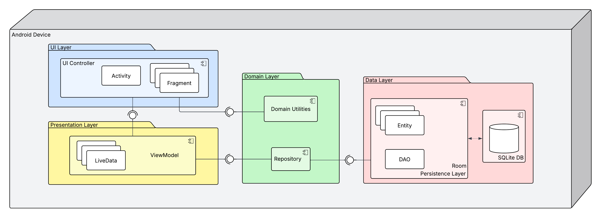
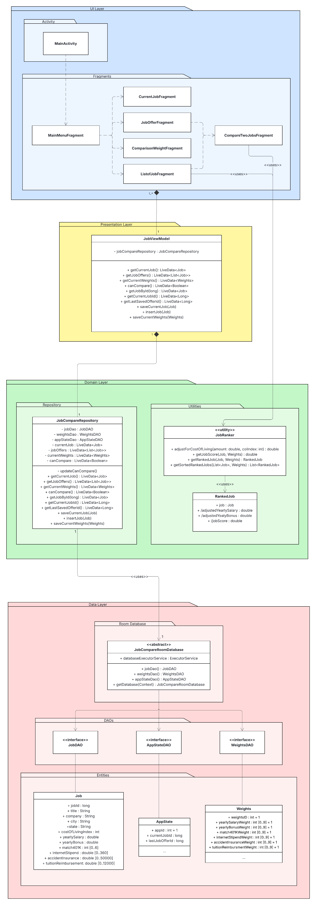
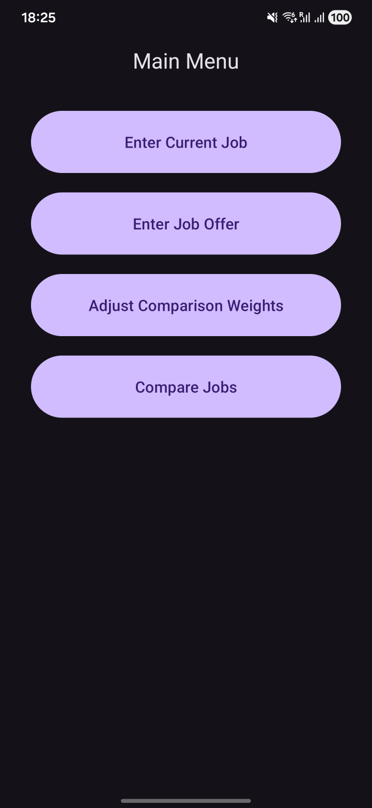
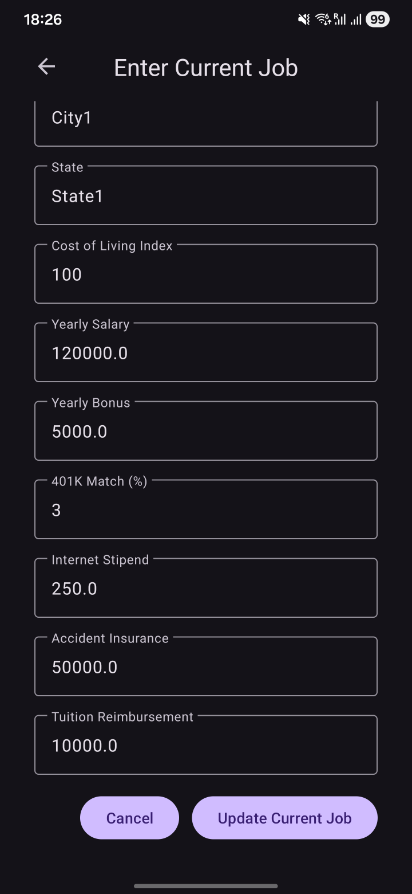
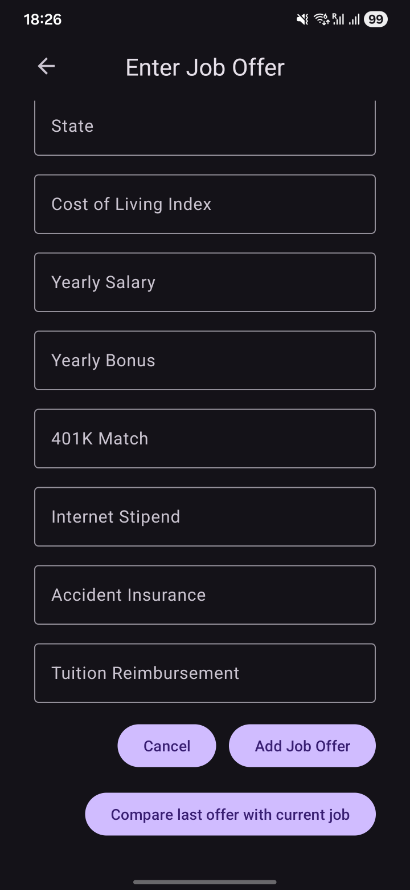
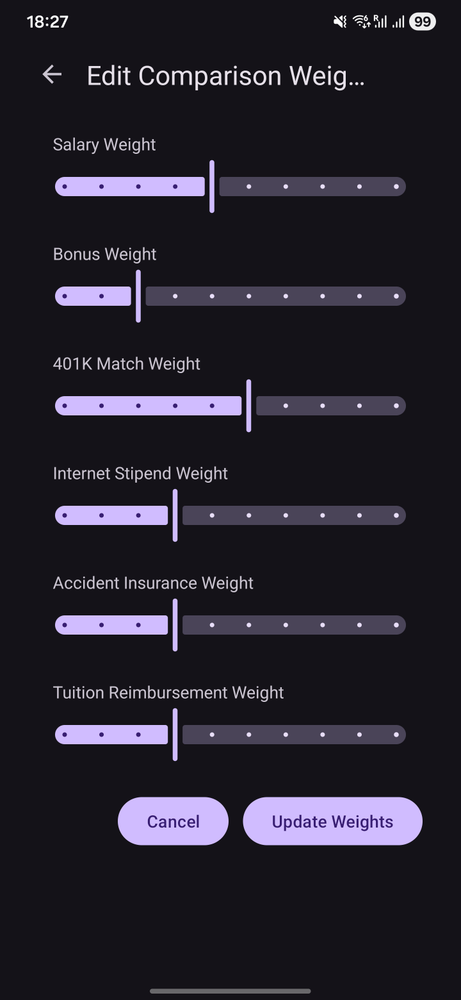
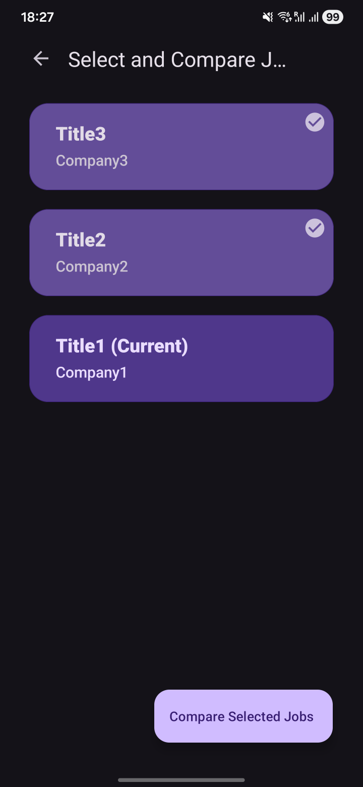
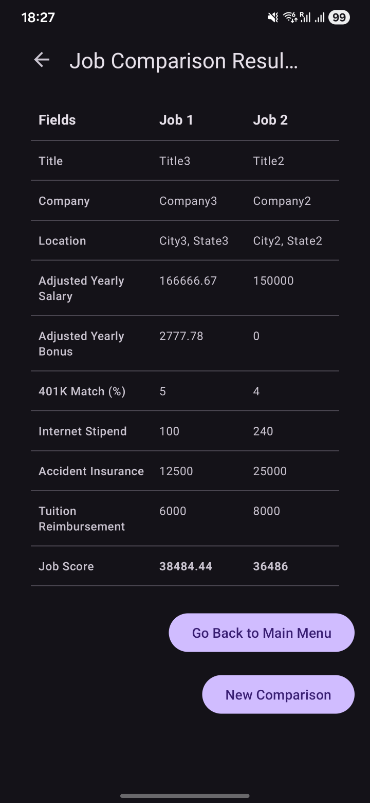

# CareerCompare

CareerCompare is a native Android app for comparing job offers against a current job or against each other. It captures compensation, location, and benefit details, stores them locally, and ranks options with cost-of-living adjustments and user-defined comparison weights.

## Features

- Save and edit a current job.
- Save multiple job offers.
- Compare offers from a ranked list.
- Adjust comparison weights for salary, bonus, 401k match, internet stipend, accident insurance, and tuition reimbursement.
- Normalize salary and bonus by cost-of-living index.
- Persist job data, app state, and weights locally in SQLite through Room.

## How Scoring Works

CareerCompare calculates a weighted score for each job using:

- Cost-of-living-adjusted yearly salary
- Cost-of-living-adjusted yearly bonus
- Estimated 401k match value
- Internet stipend
- Accident insurance
- Tuition reimbursement

The app ranks jobs by the resulting score in descending order. If all weights are set to `0`, the scorer falls back to equal weighting for all categories.

## Tech Stack

- Java 21
- Android Gradle Plugin 9.1.1
- Gradle Wrapper 9.3.1
- Android SDK 36
- Minimum SDK 34
- AndroidX AppCompat, Fragment, Navigation, RecyclerView, ConstraintLayout, CardView
- Material Components
- SQLite
- Room database abstraction library
- LiveData and AndroidViewModel
- JUnit, Robolectric, Mockito, Espresso

## Architecture

CareerCompare follows an MVVM-style architecture with clear separation between UI, presentation, domain logic, and persistence.



- **UI layer:** Android UI controllers and XML layouts. `MainActivity` hosts the app, and fragments handle each screen: `MainMenuFragment`, `CurrentJobFragment`, `JobOfferFragment`, `ComparisonWeightFragment`, `ListofJobFragment`, and `CompareTwoJobsFragment`.
- **Presentation layer:** `JobViewModel` exposes observable app state with LiveData and delegates user actions to the repository.
- **Domain layer:** Ranking models and utilities, including `RankedJob` and `JobRanker`, implement the job comparison logic.
- **Data layer:** Room DAOs, entities, the SQLite-backed `JobCompareRoomDatabase`, and `JobCompareRepository` manage local persistence and data access.

Navigation between screens is defined with the Android Navigation component in `nav_graph.xml`. The job list uses `RecyclerView` and `JobListAdaptor` to display ranked jobs dynamically.

The app is deployed as a standard APK and runs entirely on one Android device. There is no backend service or remote deployment target.

### Class Diagram



## Project Structure

```text
app/src/main/java/com/frg96/careercompare/
├── data/
│   ├── dao/          # Room DAO interfaces
│   ├── database/     # Room database setup
│   ├── entity/       # Job, weights, and app state entities
│   └── repository/   # Data access coordination
├── domain/
│   ├── model/        # Ranked job model
│   └── util/         # Job ranking logic
└── ui/
    ├── comparison/   # Comparison result screen
    ├── currentjob/   # Current job form
    ├── joblist/      # Job selection list
    ├── joboffer/     # Job offer form
    ├── main/         # Main activity and menu
    ├── viewmodel/    # Shared app view model
    └── weights/      # Comparison weights form
```

## Getting Started

### Prerequisites

- Android Studio with Android SDK 36 installed
- JDK 21
- An Android emulator or physical device running API 34 or newer

### Clone and Open

```bash
git clone <repository-url>
cd CareerCompare
```

Open the project in Android Studio and let Gradle sync. The app module is `:app`.

### Build

```bash
./gradlew assembleDebug
```

### Run Tests

Run local JVM/Robolectric unit tests:

```bash
./gradlew test
```

## Running the App

1. Launch the app from Android Studio or install the debug APK.
2. Enter your current job details.
3. Add one or more job offers.
4. Adjust comparison weights if some compensation categories matter more to you.
5. Compare jobs to see ranked results.

## Data Storage

CareerCompare uses a local SQLite database named `job_compare_database`, managed through AndroidX Room. Data stays on the device; the app does not define any network permissions in the Android manifest.

The database contains three tables:

- `jobs`
- `app_state`
- `weights_table`

Room entities define the table schemas, DAOs query and update those tables, and `JobCompareRepository` provides a single access point for the rest of the app.

## Development Notes

- Navigation is defined in `app/src/main/res/navigation/nav_graph.xml`.
- The ranking logic lives in `JobRanker`.
- Main persistence flows through `JobCompareRepository`.
- Database writes are dispatched through the `ExecutorService` in `JobCompareRoomDatabase` so persistence work does not block the UI thread.
- Unit tests cover ranking behavior and fragment workflows.

## App Screenshots

| Main Menu | Current Job |
| --- | --- |
|  |  |

| Job Offer | Comparison Weights |
| --- | --- |
|  |  |

| Job List | Compare Two Jobs |
| --- | --- |
|  |  |
